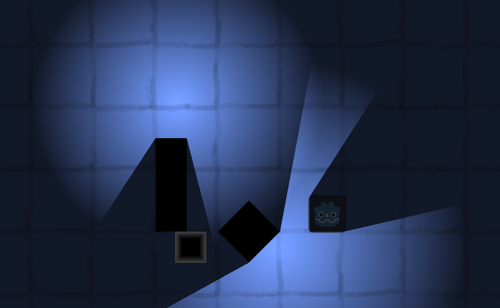
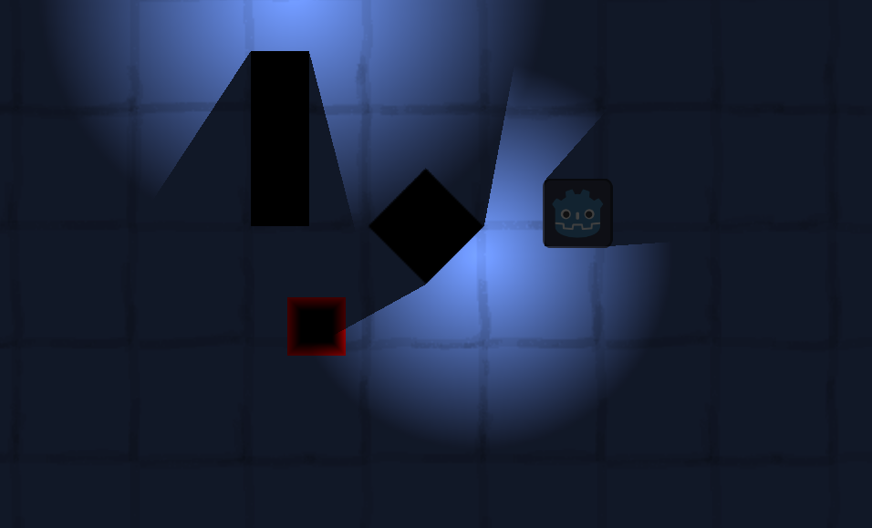

# Northern Lights

A small experiment to showcase lighting and light area detection in Godot 4.7.1.

- Lights with occlusion (both `TileMapLayers` and other 2D objects)
- Highly efficient light detection system:
    - Keeps an `Array` of light sources within range to the object. 
    - Keeps on array of `RayCast2D` objects to check border points of the object.
    - Highly efficient, at most $N * M$ (where $N$ is the size of the light source array and $M$ the number of border points). This allows to have a high number of light sources, "culled" by their overlapping areas. 

Todo:
- Cone lights, useful to enemy/player FOV.
- Packaging as a reusable plugin.

## Example Project

Top down 2D scene with:

- Animated light sources, with shadow casting (occlusion).
- Simple `CharacterBody2D` player (WASD/controller). 
    - Physics based collision to obstacles.
    - $M$ point border detection, tinting the player red when lit by ray.

### Unlit

### Lit

## Content Declaration

- All assets created from scratch without use of AI.
- All code manually written, AI has been used only as information source.

## License

Copyright Per Lindgren, the source code is available at GitHub for educational use only. 